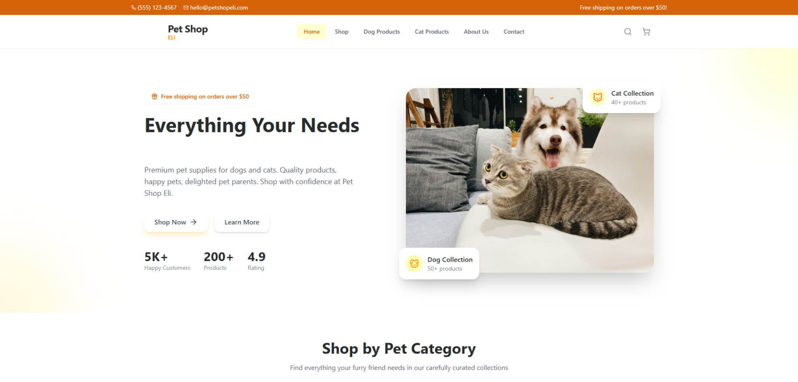

# 🐾 Pet Shop E-commerce Website

A modern and responsive pet shop website built with React, TypeScript and Tailwind CSS.

🌐 Live Demo:

https://elham-barzegar.github.io/petshop-Eli

## 📌 Overview

This project showcases a modern e-commerce interface for pet products with a focus on responsive design, reusable components, and user-friendly experience.

The development process included AI-assisted workflows to improve productivity and explore modern frontend development approaches.

## ✨ Features

- Responsive pet shop interface
- Modern UI components
- Product-focused design
- Reusable React components
- Mobile-first approach
- Tailwind CSS styling

## 🛠 Technologies

- React
- TypeScript
- Tailwind CSS
- JavaScript
- AI-assisted development workflow

## 👩‍💻 Author

Elham Barzegar

Front-End Developer

Portfolio:
https://elhambarzegar.ir
